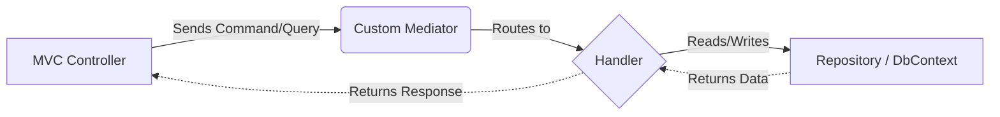

# 🏗️ Architecture Guide

## Overview

The Apartment Management System is built on a robust, enterprise-grade architecture leveraging **Clean Architecture**, **Domain-Driven Design (DDD)**, and the **Command Query Responsibility Segregation (CQRS)** pattern. 

By heavily decoupling business logic from infrastructural concerns and UI rendering, the application ensures high testability, maintainability, and scalability.

## Clean Architecture Layers

The solution is divided into four distinct class libraries, adhering strictly to the Dependency Rule: *dependencies only point inwards toward the Domain.*

```mermaid
flowchart TD
    Web[AMS.Web (UI/API)] -.-> Application[AMS.Application]
    Infrastructure[AMS.Infrastructure] -.-> Application
    Application -.-> Domain[AMS.Domain]
    
    style Domain fill:#2c3e50,stroke:#34495e,stroke-width:2px,color:#fff
    style Application fill:#2980b9,stroke:#3498db,stroke-width:2px,color:#fff
    style Infrastructure fill:#27ae60,stroke:#2ecc71,stroke-width:2px,color:#fff
    style Web fill:#8e44ad,stroke:#9b59b6,stroke-width:2px,color:#fff
```

### 1. `AMS.Domain`
At the absolute center of the application is the Domain layer. It contains no external dependencies.
- **Entities & Aggregates:** Core business objects (e.g., `Building`, `Flat`, `ApplicationUser`).
- **Value Objects:** Immutable types describing domain concepts.
- **Domain Events:** Events raised when significant business actions occur.
- **Exceptions:** Domain-specific business rule exceptions.
- **Interfaces:** Abstractions for infrastructure (e.g., `IAuditableEntity`, `ISoftDeletable`).

### 2. `AMS.Application`
This layer orchestrates the business use cases. It depends only on the Domain.
- **CQRS (Commands & Queries):** Use cases are split into Commands (writes/mutations) and Queries (reads).
- **Handlers:** Execution logic for the respective commands and queries.
- **Interfaces:** Contracts for external services that the infrastructure must implement (e.g., `IEmailService`, repositories).
- **Custom Mediator:** A bespoke, lightweight Mediator pattern implementation used to route requests to their appropriate handlers without relying on heavy third-party libraries like MediatR.

### 3. `AMS.Infrastructure`
This layer implements the interfaces defined in the Application layer and encapsulates all external communication.
- **Data Access:** EF Core `ApplicationDbContext` and repository implementations. Entity configurations (`IEntityTypeConfiguration`) are cleanly separated to keep the DbContext thin.
- **Identity:** ASP.NET Core Identity integration.
- **External Services:** Stripe payment processing, Cloudinary image hosting, SMTP Email delivery.
- **Background Jobs:** Hosted workers for tasks like monthly recurring billing.

### 4. `AMS.Web`
The presentation layer, serving as the composition root.
- **MVC Controllers & Razor Views:** UI rendering and HTTP request handling.
- **Dependency Injection:** `Program.cs` composes the application by registering dependencies from all layers.
- **Middlewares:** Global exception handling and localized request routing.

## CQRS and Custom Mediator Request Flow

Unlike traditional MVC applications where controllers invoke heavy "Feature Services", this application uses a strictly separated CQRS flow.



### Why a Custom Mediator?
Instead of using MediatR, the project utilizes a custom, lightweight `IMediator` implementation located in `AMS.Application.Mediator`. 
- **Simplicity:** It provides exactly what is needed (`IRequest`, `IRequestHandler`) without reflection bloat.
- **Transparency:** The routing mechanism is explicit and easily debuggable.
- **Performance:** Direct service resolution from the `IServiceProvider`.

## Feature Boundaries (Vertical Slices)

Within the `AMS.Application` layer, use cases are organized by feature areas (Vertical Slice Architecture) rather than by technical concern:

| Area | Responsibility |
| --- | --- |
| **Administration** | SuperAdmin dashboards, president assignments, role management. |
| **Buildings** | Building and flat lifecycle commands/queries. |
| **Tenancy**| Tenant assignment, billing profiles, and rent generation. |
| **Expenses**| Common bills, owner allocations, and expense payments. |
| **Payments** | Stripe Checkout integration and webhook processing. |
| **Operations** | Announcements, Entry Logs, Maintenance tickets. |

> [!TIP]
> **Controller Scope:** Controllers should remain completely devoid of business logic. Their only job is to receive an HTTP request, map it to a Command or Query, send it via the Mediator, and return the appropriate Razor View or HTTP response.

## Data Model and Persistence

Persistence is managed by Entity Framework Core using SQL Server.

- **Thin DbContext:** `ApplicationDbContext` inherits `IdentityDbContext<ApplicationUser>`. All manual fluent configurations have been extracted into individual `IEntityTypeConfiguration<T>` classes within the `Infrastructure/Data/Configurations` folder. They are automatically applied on startup via `ApplyConfigurationsFromAssembly`.
- **Soft Deletes & Auditing:** The `SaveChanges` interceptor automatically sets `CreatedAt`/`UpdatedAt` timestamps and handles soft deletion logic for entities implementing `ISoftDeletable`.
