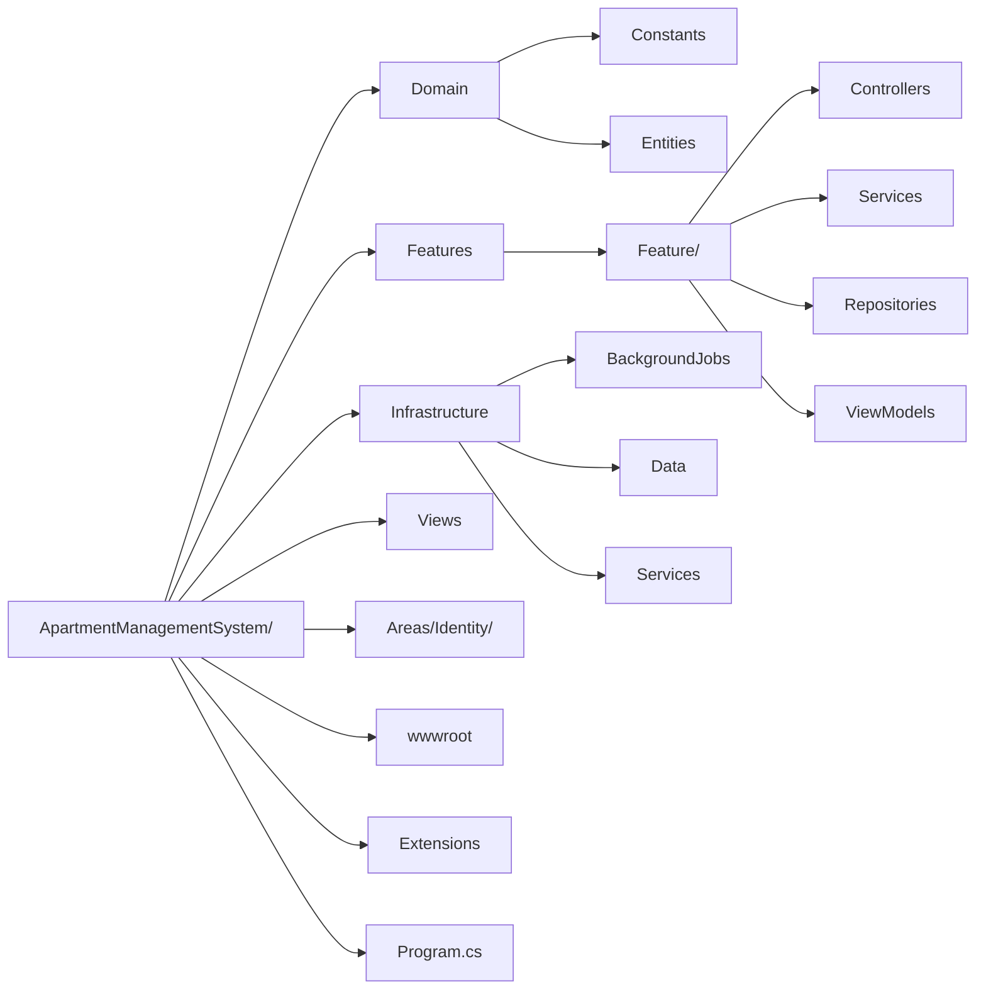
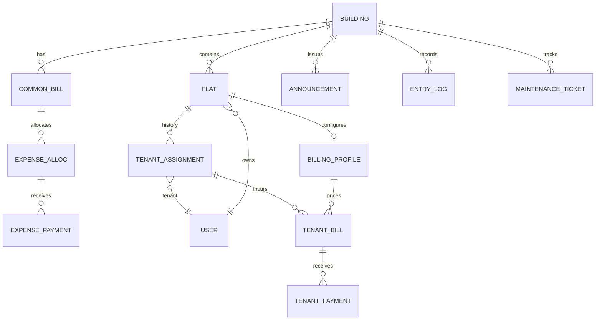

# 🏗️ Architecture Guide

## Overview

Apartment Management System is a robust and feature rich ASP.NET Core MVC application. It leverages a feature-oriented application layer above shared infrastructure and a SQL Server database. Browser requests are served by Razor views; there is no separate public API or client application.

### Request Flow

```mermaid
flowchart TD
    A[Browser] -->|HTTP Request| B(MVC Controller + Razor View)
    B --> C{Feature Service}
    C --> D[Feature Repository]
    D --> E[(ApplicationDbContext / SQL Server)]
    
    subgraph Cross-Cutting Concerns
    F[ASP.NET Identity]
    G[Stripe Payments]
    H[SMTP Email]
    I[Cloudinary]
    J[Hosted Billing Worker]
    end
    
    C -.-> Cross-Cutting Concerns
```

## Runtime Composition

`Program.cs` is the composition root. It registers MVC, localization, infrastructure, feature services, authentication and authorization, then maps the conventional MVC route and Identity Razor Pages.

`Extensions/ServiceCollectionExtensions.cs` centralizes dependency registration:

- `AddInfrastructure` configures SQL Server EF Core, ASP.NET Identity, claims/sign-in customizations, email, Cloudinary, Stripe, and the monthly billing hosted service.
- `AddFeatureServices` maps feature interfaces to scoped repositories and services.

The application uses the `en-US` culture with the currency symbol displayed as `tk`.

## Project Layout



## Feature Boundaries

The `Features` folder contains the controllers, services, repositories, and view models organized by feature areas:

| Area | Responsibility |
| --- | --- |
| **Administration** | User approval, role management, president assignment, and dashboards. |
| **Buildings and Flats** | Building/flat lifecycle and owner assignment. |
| **Tenancy & Tenant Billing**| Tenant directory/assignment, billing profiles, rent, and receipts. |
| **Tenant Portal** | Tenant-facing bills, payments, notices, visitors, and tickets. |
| **Expenses & Owner Billing**| Common bills, allocations, expense payments, owner balances, and receipts. |
| **Payments** | Stripe Checkout session creation, webhook handling, and payment persistence. |
| **Day-to-day Operations** | Announcements, Entry Logs, Maintenance. |
| **Reports** | Building dashboards and financial, occupancy, visitor, and maintenance reports. |

> [!TIP]
> **Controller Scope:** Controllers should remain focused on HTTP concerns (request binding, validation, calling a service, selecting a response/view). Services own workflows. New features should adhere strictly to this separation.

## Identity and Authorization

`ApplicationUser` extends ASP.NET Identity's user model with a full name, optional building, approval state, and profile image URL. 

The custom claims principal factory exposes building information in the signed-in user's claims. Controllers use role attributes, and services/repositories apply building and ownership boundaries where required. 

> [!CAUTION]
> Authorization must be enforced server-side. Do not rely on UI/sidebar visibility for access control.

## Data Model and Invariants

`ApplicationDbContext` inherits `IdentityDbContext<ApplicationUser>` and uses the default SQL schema `ams`.

### Entity Relationships



**Key Invariants:**
- Building names and codes are unique.
- A flat number is unique within its building.
- Active tenant assignments are uniquely constrained using filtered indexes (`EndDate IS NULL`).
- A flat has at most one billing profile.
- Payment idempotency keys are strictly unique.
- Tenant bills utilize a row-version concurrency token.

## External Integrations

### Payments (Stripe)
`StripePaymentService` creates Checkout sessions. Metadata identifies the payment subject. The `POST /payments/webhook` endpoint verifies signatures and processes `checkout.session.completed` and `payment_intent.succeeded`. 

### Email and Uploads
`PaymentEmailService` handles SMTP email delivery for receipts. `CloudinaryPhotoUploadService` handles uploads. Keys should **never** be placed in source-controlled configuration.

## Background Work
`TenantMonthlyBillGenerator` is a `BackgroundService` that runs shortly after midnight on the first day of the month to generate bills based on active tenant assignments. 

> [!IMPORTANT]
> Because this worker runs in the web process, you must deploy a single application instance or implement distributed locking before scaling out. It relies on the server's local `DateTime`.
